# Understanding the Orchestration System

Oh My OpenCode's orchestration system transforms a simple AI agent into a coordinated development team. This document explains how the Prometheus → Atlas → Junior workflow creates high-quality, reliable code output.

---

## The Core Philosophy

Traditional AI coding tools follow a simple pattern: user asks → AI responds. This works for small tasks but fails for complex work because:

1. **Context overload**: Large tasks exceed context windows
2. **Cognitive drift**: AI loses track of requirements mid-task
3. **Verification gaps**: No systematic way to ensure completeness
4. **Human = Bottleneck**: Requires constant user intervention

The orchestration system solves these problems through **specialization and delegation**.

---

## The Three-Layer Architecture

```mermaid
flowchart TB
    subgraph Planning["Planning Layer (Human + Prometheus)"]
        User[("👤 User")]
        Prometheus["🔥 Prometheus<br/>(Planner)<br/>Claude Opus 4.5"]
        Metis["🦉 Metis<br/>(Consultant)<br/>Claude Opus 4.5"]
        Momus["👁️ Momus<br/>(Reviewer)<br/>GPT-5.2"]
    end
    
    subgraph Execution["Execution Layer (Orchestrator)"]
        Orchestrator["⚡ Atlas<br/>(Conductor)<br/>Claude Opus 4.5"]
    end
    
    subgraph Workers["Worker Layer (Specialized Agents)"]
        Junior["🪨 Sisyphus-Junior<br/>(Task Executor)<br/>Claude Sonnet 4.5"]
        Oracle["🧠 Oracle<br/>(Architecture)<br/>GPT-5.2"]
        Explore["🔍 Explore<br/>(Codebase Grep)<br/>Grok Code"]
        Librarian["📚 Librarian<br/>(Docs/OSS)<br/>GLM-4.7"]
        Frontend["🎨 Frontend<br/>(UI/UX)<br/>Gemini 3 Pro"]
    end
    
    User -->|"Describe work"| Prometheus
    Prometheus -->|"Consult"| Metis
    Prometheus -->|"Interview"| User
    Prometheus -->|"Generate plan"| Plan[".sisyphus/plans/*.md"]
    Plan -->|"High accuracy?"| Momus
    Momus -->|"OKAY / REJECT"| Prometheus
    
    User -->|"/start-work"| Orchestrator
    Plan -->|"Read"| Orchestrator
    
    Orchestrator -->|"task(category)"| Junior
    Orchestrator -->|"task(agent)"| Oracle
    Orchestrator -->|"task(agent)"| Explore
    Orchestrator -->|"task(agent)"| Librarian
    Orchestrator -->|"task(agent)"| Frontend
    
    Junior -->|"Results + Learnings"| Orchestrator
    Oracle -->|"Advice"| Orchestrator
    Explore -->|"Code patterns"| Orchestrator
    Librarian -->|"Documentation"| Orchestrator
    Frontend -->|"UI code"| Orchestrator
```



---

## Layer 1: Planning (Prometheus + Metis + Momus)

### Prometheus: Your Strategic Consultant

Prometheus is **not just a planner** - it's an intelligent interviewer that helps you think through what you actually need.

**The Interview Process:**


**Intent-Specific Strategies:**

Prometheus adapts its interview style based on what you're doing:

| Intent | Prometheus Focus | Example Questions |
|--------|------------------|-------------------|
| **Refactoring** | Safety - behavior preservation | "What tests verify current behavior?" "Rollback strategy?" |
| **Build from Scratch** | Discovery - patterns first | "Found pattern X in codebase. Follow it or deviate?" |
| **Mid-sized Task** | Guardrails - exact boundaries | "What must NOT be included? Hard constraints?" |
| **Architecture** | Strategic - long-term impact | "Expected lifespan? Scale requirements?" |

### Metis: The Gap Analyzer

Before Prometheus writes the plan, **Metis catches what Prometheus missed**:

- Hidden intentions in user's request
- Ambiguities that could derail implementation
- AI-slop patterns (over-engineering, scope creep)
- Missing acceptance criteria
- Edge cases not addressed

**Why Metis Exists:**

The plan author (Prometheus) has "ADHD working memory" - it makes connections that never make it onto the page. Metis forces externalization of implicit knowledge.

### Momus: The Ruthless Reviewer

For high-accuracy mode, Momus validates plans against **four core criteria**:

1. **Clarity**: Does each task specify WHERE to find implementation details?
2. **Verification**: Are acceptance criteria concrete and measurable?
3. **Context**: Is there sufficient context to proceed without >10% guesswork?
4. **Big Picture**: Is the purpose, background, and workflow clear?

**The Momus Loop:**

Momus only says "OKAY" when:
- 100% of file references verified
- ≥80% of tasks have clear reference sources
- ≥90% of tasks have concrete acceptance criteria
- Zero tasks require assumptions about business logic
- Zero critical red flags

If REJECTED, Prometheus fixes issues and resubmits. **No maximum retry limit.**

---

## Layer 2: Execution (Atlas)

### The Conductor Mindset

The Orchestrator is like an orchestra conductor: **it doesn't play instruments, it ensures perfect harmony**.


**What Orchestrator CAN do:**
- ✅ Read files to understand context
- ✅ Run commands to verify results
- ✅ Use lsp_diagnostics to check for errors
- ✅ Search patterns with grep/glob/ast-grep

**What Orchestrator MUST delegate:**
- ❌ Writing/editing code files
- ❌ Fixing bugs
- ❌ Creating tests
- ❌ Git commits

### Wisdom Accumulation

The power of orchestration is **cumulative learning**. After each task:

1. Extract learnings from subagent's response
2. Categorize into: Conventions, Successes, Failures, Gotchas, Commands
3. Pass forward to ALL subsequent subagents

This prevents repeating mistakes and ensures consistent patterns.

**Notepad System:**

```
.sisyphus/notepads/{plan-name}/
├── learnings.md      # Patterns, conventions, successful approaches
├── decisions.md      # Architectural choices and rationales
├── issues.md         # Problems, blockers, gotchas encountered
├── verification.md   # Test results, validation outcomes
└── problems.md       # Unresolved issues, technical debt
```

### Parallel Execution

Independent tasks run in parallel:

```typescript
// Orchestrator identifies parallelizable groups from plan
// Group A: Tasks 2, 3, 4 (no file conflicts)
task(category="ultrabrain", prompt="Task 2...")
task(category="visual-engineering", prompt="Task 3...")
task(category="general", prompt="Task 4...")
// All run simultaneously
```

---

## Layer 3: Workers (Specialized Agents)

### Sisyphus-Junior: The Task Executor

Junior is the **workhorse** that actually writes code. Key characteristics:

- **Focused**: Cannot delegate (blocked from task tool)
- **Disciplined**: Obsessive todo tracking
- **Verified**: Must pass lsp_diagnostics before completion
- **Constrained**: Cannot modify plan files (READ-ONLY)

**Why Sonnet is Sufficient:**

Junior doesn't need to be the smartest - it needs to be reliable. With:
1. Detailed prompts from Orchestrator (50-200 lines)
2. Accumulated wisdom passed forward
3. Clear MUST DO / MUST NOT DO constraints
4. Verification requirements

Even a mid-tier model executes precisely. The intelligence is in the **system**, not individual agents.

### System Reminder Mechanism

The hook system ensures Junior never stops halfway:

```
[SYSTEM REMINDER - TODO CONTINUATION]

You have incomplete todos! Complete ALL before responding:
- [ ] Implement user service ← IN PROGRESS
- [ ] Add validation
- [ ] Write tests

DO NOT respond until all todos are marked completed.
```

This "boulder pushing" mechanism is why the system is named after Sisyphus.

---

## The task Tool: Category + Skill System

### Why Categories are Revolutionary

**The Problem with Model Names:**

```typescript
// OLD: Model name creates distributional bias
task(agent="gpt-5.2", prompt="...")  // Model knows its limitations
task(agent="claude-opus-4.6", prompt="...")  // Different self-perception
```

**The Solution: Semantic Categories:**

```typescript
// NEW: Category describes INTENT, not implementation
task(category="ultrabrain", prompt="...")     // "Think strategically"
task(category="visual-engineering", prompt="...")  // "Design beautifully"
task(category="quick", prompt="...")          // "Just get it done fast"
```

### Built-in Categories

| Category | Model | When to Use |
|----------|-------|-------------|
| `visual-engineering` | Gemini 3 Pro | Frontend, UI/UX, design, styling, animation |
| `ultrabrain` | GPT-5.2 Codex (xhigh) | Deep logical reasoning, complex architecture decisions |
| `artistry` | Gemini 3 Pro (max) | Highly creative/artistic tasks, novel ideas |
| `quick` | Claude Haiku 4.5 | Trivial tasks - single file changes, typo fixes |
| `unspecified-low` | Claude Sonnet 4.5 | Tasks that don't fit other categories, low effort |
| `unspecified-high` | Claude Opus 4.5 (max) | Tasks that don't fit other categories, high effort |
| `writing` | Gemini 3 Flash | Documentation, prose, technical writing |

### Custom Categories

You can define your own categories:

```json
// .opencode/oh-my-opencode.json
{
  "categories": {
    "unity-game-dev": {
      "model": "openai/gpt-5.2",
      "temperature": 0.3,
      "prompt_append": "You are a Unity game development expert..."
    }
  }
}
```

### Skills: Domain-Specific Instructions

Skills prepend specialized instructions to subagent prompts:

```typescript
// Category + Skill combination
task(
  category="visual-engineering", 
  load_skills=["frontend-ui-ux"],  // Adds UI/UX expertise
  prompt="..."
)

task(
  category="general",
  load_skills=["playwright"],  // Adds browser automation expertise
  prompt="..."
)
```

**Example Evolution:**

| Before | After |
|--------|-------|
| Hardcoded: `frontend-ui-ux-engineer` (Gemini 3 Pro) | `category="visual-engineering" + load_skills=["frontend-ui-ux"]` |
| One-size-fits-all | `category="visual-engineering" + load_skills=["unity-master"]` |
| Model bias | Category-based: model abstraction eliminates bias |

---

## The Orchestrator → Junior Workflow


---

## Why This Architecture Works

### 1. Separation of Concerns

- **Planning** (Prometheus): High reasoning, interview, strategic thinking
- **Orchestration** (Atlas): Coordination, verification, wisdom accumulation
- **Execution** (Junior): Focused implementation, no distractions

### 2. Explicit Over Implicit

Every Junior prompt includes:
- Exact task from plan
- Clear success criteria
- Forbidden actions
- All accumulated wisdom
- Reference files with line numbers

No assumptions. No guessing.

### 3. Trust But Verify

The Orchestrator **never trusts subagent claims**:
- Runs `lsp_diagnostics` at project level
- Executes full test suite
- Reads actual file changes
- Cross-references requirements

### 4. Model Optimization

Expensive models (Opus, GPT-5.2) used only where needed:
- Planning decisions (once per project)
- Debugging consultation (rare)
- Complex architecture (rare)

Bulk work goes to cost-effective models (Sonnet, Haiku, Flash).

---

## Getting Started

1. **Enter Prometheus Mode**: Press **Tab** at the prompt
2. **Describe Your Work**: "I want to add user authentication to my app"
3. **Answer Interview Questions**: Prometheus will ask about patterns, preferences, constraints
4. **Review the Plan**: Check `.sisyphus/plans/` for generated work plan
5. **Run `/start-work`**: Orchestrator takes over
6. **Observe**: Watch tasks complete with verification
7. **Done**: All todos complete, code verified, ready to ship

---

## Further Reading

- [Overview](./overview.md) - Quick start guide
- [Ultrawork Manifesto](../ultrawork-manifesto.md) - Philosophy behind the system
- [Installation Guide](./installation.md) - Detailed installation instructions
- [Configuration](../configurations.md) - Customize the orchestration
