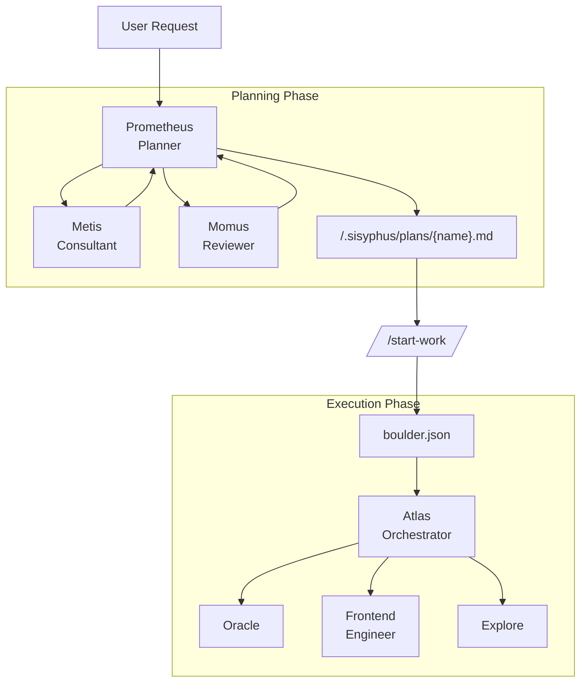

# Oh-My-OpenCode Orchestration Guide

## TL;DR - When to Use What

| Complexity | Approach | When to Use |
|------------|----------|-------------|
| **Simple** | Just prompt | Simple tasks, quick fixes, single-file changes |
| **Complex + Lazy** | Just type `ulw` or `ultrawork` | Complex tasks where explaining context is tedious. Agent figures it out. |
| **Complex + Precise** | `@plan` → `/start-work` | Precise, multi-step work requiring true orchestration. Prometheus plans, Atlas executes. |

**Decision Flow:**

```
Is it a quick fix or simple task?
  └─ YES → Just prompt normally
  └─ NO  → Is explaining the full context tedious?
             └─ YES → Type "ulw" and let the agent figure it out
             └─ NO  → Do you need precise, verifiable execution?
                        └─ YES → Use @plan for Prometheus planning, then /start-work
                        └─ NO  → Just use "ulw"
```

---

This document provides a comprehensive guide to the orchestration system that implements Oh-My-OpenCode's core philosophy: **"Separation of Planning and Execution"**.

## 1. Overview

Traditional AI agents often mix planning and execution, leading to context pollution, goal drift, and AI slop (low-quality code).

Oh-My-OpenCode solves this by clearly separating two roles:

1. **Prometheus (Planner)**: A pure strategist who never writes code. Establishes perfect plans through interviews and analysis.
2. **Atlas (Executor)**: An orchestrator who executes plans. Delegates work to specialized agents and never stops until completion.

---

## 2. Prometheus Invocation: Agent Switch vs @plan

A common source of confusion is how to invoke Prometheus for planning. **Both methods achieve the same result** - use whichever feels natural.

### Method 1: Switch to Prometheus Agent (Tab → Select Prometheus)

```
1. Press Tab at the prompt
2. Select "Prometheus" from the agent list
3. Describe your work: "I want to refactor the auth system"
4. Answer interview questions
5. Prometheus creates plan in .sisyphus/plans/{name}.md
```

### Method 2: Use @plan Command (in Sisyphus)

```
1. Stay in Sisyphus (default agent)
2. Type: @plan "I want to refactor the auth system"
3. The @plan command automatically switches to Prometheus
4. Answer interview questions
5. Prometheus creates plan in .sisyphus/plans/{name}.md
```

### Which Should You Use?

| Scenario | Recommended Method | Why |
|----------|-------------------|-----|
| **New session, starting fresh** | Switch to Prometheus agent | Clean mental model - you're entering "planning mode" |
| **Already in Sisyphus, mid-work** | Use @plan | Convenient, no agent switch needed |
| **Want explicit control** | Switch to Prometheus agent | Clear separation of planning vs execution contexts |
| **Quick planning interrupt** | Use @plan | Fastest path from current context |

**Key Insight**: Both methods trigger the same Prometheus planning flow. The @plan command is simply a convenience shortcut that:
1. Detects the `@plan` keyword in your message
2. Routes the request to Prometheus automatically
3. Returns you to Sisyphus after planning completes

---

## 3. /start-work Behavior in Fresh Sessions

One of the most powerful features of the orchestration system is **session continuity**. Understanding how `/start-work` behaves across sessions prevents confusion.

### What Happens When You Run /start-work

```
User: /start-work
    ↓
[start-work hook activates]
    ↓
Check: Does .sisyphus/boulder.json exist?
    ↓
    ├─ YES (existing work) → RESUME MODE
    │   - Read the existing boulder state
    │   - Calculate progress (checked vs unchecked boxes)
    │   - Inject continuation prompt with remaining tasks
    │   - Atlas continues where you left off
    │
    └─ NO (fresh start) → INIT MODE
        - Find the most recent plan in .sisyphus/plans/
        - Create new boulder.json tracking this plan
        - Switch session agent to Atlas
        - Begin execution from task 1
```

### Session Continuity Explained

The `boulder.json` file tracks:
- **active_plan**: Path to the current plan file
- **session_ids**: All sessions that have worked on this plan
- **started_at**: When work began
- **plan_name**: Human-readable plan identifier

**Example Timeline:**

```
Monday 9:00 AM
  └─ @plan "Build user authentication"
  └─ Prometheus interviews and creates plan
  └─ User: /start-work
  └─ Atlas begins execution, creates boulder.json
  └─ Task 1 complete, Task 2 in progress...
  └─ [Session ends - computer crash, user logout, etc.]

Monday 2:00 PM (NEW SESSION)
  └─ User opens new session (agent = Sisyphus by default)
  └─ User: /start-work
  └─ [start-work hook reads boulder.json]
  └─ "Resuming 'Build user authentication' - 3 of 8 tasks complete"
  └─ Atlas continues from Task 3 (no context lost)
```

### When You DON'T Need to Manually Switch to Atlas

Atlas is **automatically activated** when you run `/start-work`. You don't need to:
- Switch to Atlas agent manually
- Remember which agent you were using
- Worry about session continuity

The `/start-work` command handles all of this.

### When You MIGHT Want to Manually Switch to Atlas

There are rare cases where manual agent switching helps:

| Scenario | Action | Why |
|----------|--------|-----|
| **Plan file was edited manually** | Switch to Atlas, read plan directly | Bypass boulder.json resume logic |
| **Debugging orchestration issues** | Switch to Atlas for visibility | See Atlas-specific system prompts |
| **Force fresh execution** | Delete boulder.json, then /start-work | Start from task 1 instead of resuming |
| **Multi-plan management** | Switch to Atlas to select specific plan | Override auto-selection |

**Command to manually switch:** Press `Tab` → Select "Atlas"

---

## 4. Execution Modes: Hephaestus vs Sisyphus+ultrawork

Another common question: **When should I use Hephaestus vs just typing `ulw` in Sisyphus?**

### Quick Comparison

| Aspect | Hephaestus | Sisyphus + `ulw` / `ultrawork` |
|--------|-----------|-------------------------------|
| **Model** | GPT-5.2 Codex (medium reasoning) | Claude Opus 4.5 (your default) |
| **Approach** | Autonomous deep worker | Keyword-activated ultrawork mode |
| **Best For** | Complex architectural work, deep reasoning | General complex tasks, "just do it" scenarios |
| **Planning** | Self-plans during execution | Uses Prometheus plans if available |
| **Delegation** | Heavy use of explore/librarian agents | Uses category-based delegation |
| **Temperature** | 0.1 | 0.1 |

### When to Use Hephaestus

Switch to Hephaestus (Tab → Select Hephaestus) when:

1. **Deep architectural reasoning needed**
   - "Design a new plugin system"
   - "Refactor this monolith into microservices"

2. **Complex debugging requiring inference chains**
   - "Why does this race condition only happen on Tuesdays?"
   - "Trace this memory leak through 15 files"

3. **Cross-domain knowledge synthesis**
   - "Integrate our Rust core with the TypeScript frontend"
   - "Migrate from MongoDB to PostgreSQL with zero downtime"

4. **You specifically want GPT-5.2 Codex reasoning**
   - Some problems benefit from GPT-5.2's training characteristics

**Example:**
```
[Switch to Hephaestus]
"I need to understand how data flows through this entire system
and identify all the places where we might lose transactions.
Explore thoroughly before proposing fixes."
```

### When to Use Sisyphus + `ulw` / `ultrawork`

Use the `ulw` keyword in Sisyphus when:

1. **You want the agent to figure it out**
   - "ulw fix the failing tests"
   - "ulw add input validation to the API"

2. **Complex but well-scoped tasks**
   - "ulw implement JWT authentication following our patterns"
   - "ulw create a new CLI command for deployments"

3. **You're feeling lazy** (officially supported use case)
   - Don't want to write detailed requirements
   - Trust the agent to explore and decide

4. **You want to leverage existing plans**
   - If a Prometheus plan exists, `ulw` mode can use it
   - Falls back to autonomous exploration if no plan

**Example:**
```
[Stay in Sisyphus]
"ulw refactor the user service to use the new repository pattern"

[Agent automatically:]
- Explores existing codebase patterns
- Implements the refactor
- Runs verification (tests, typecheck)
- Reports completion
```

### Key Difference in Practice

| Hephaestus | Sisyphus + ulw |
|------------|----------------|
| You manually switch to Hephaestus agent | You type `ulw` in any Sisyphus session |
| GPT-5.2 Codex with medium reasoning | Your configured default model |
| Optimized for autonomous deep work | Optimized for general execution |
| Always uses explore-first approach | Respects existing plans if available |
| "Smart intern that needs no supervision" | "Smart intern that follows your workflow" |

### Recommendation

**For most users**: Use `ulw` keyword in Sisyphus. It's the default path and works excellently for 90% of complex tasks.

**For power users**: Switch to Hephaestus when you specifically need GPT-5.2 Codex's reasoning style or want the "AmpCode deep mode" experience of fully autonomous exploration and execution.

---

## 5. Overall Architecture



---

## 6. Key Components

### 🔮 Prometheus (The Planner)

- **Model**: `anthropic/claude-opus-4-6`
- **Role**: Strategic planning, requirements interviews, work plan creation
- **Constraint**: **READ-ONLY**. Can only create/modify markdown files within `.sisyphus/` directory.
- **Characteristic**: Never writes code directly, focuses solely on "how to do it".

### 🦉 Metis (The Plan Consultant)

- **Role**: Pre-analysis and gap detection
- **Function**: Identifies hidden user intent, prevents AI over-engineering, eliminates ambiguity.
- **Workflow**: Metis consultation is mandatory before plan creation.

### ⚖️ Momus (The Plan Reviewer)

- **Role**: High-precision plan validation (High Accuracy Mode)
- **Function**: Rejects and demands revisions until the plan is perfect.
- **Trigger**: Activated when user requests "high accuracy".

### ⚡ Atlas (The Plan Executor)

- **Model**: `anthropic/claude-sonnet-4-5` (Extended Thinking 32k)
- **Role**: Execution and delegation
- **Characteristic**: Doesn't do everything directly, actively delegates to specialized agents (Frontend, Librarian, etc.).

---

## 7. Workflow

### Phase 1: Interview and Planning (Interview Mode)

Prometheus starts in **interview mode** by default. Instead of immediately creating a plan, it collects sufficient context.

1. **Intent Identification**: Classifies whether the user's request is Refactoring or New Feature.
2. **Context Collection**: Investigates codebase and external documentation through `explore` and `librarian` agents.
3. **Draft Creation**: Continuously records discussion content in `.sisyphus/drafts/`.

### Phase 2: Plan Generation

When the user requests "Make it a plan", plan generation begins.

1. **Metis Consultation**: Confirms any missed requirements or risk factors.
2. **Plan Creation**: Writes a single plan in `.sisyphus/plans/{name}.md` file.
3. **Handoff**: Once plan creation is complete, guides user to use `/start-work` command.

### Phase 3: Execution

When the user enters `/start-work`, the execution phase begins.

1. **State Management**: Creates/reads `boulder.json` file to track current plan and session ID.
2. **Task Execution**: Atlas reads the plan and processes TODOs one by one.
3. **Delegation**: UI work is delegated to Frontend agent, complex logic to Oracle.
4. **Continuity**: Even if the session is interrupted, work continues in the next session through `boulder.json`.

---

## 8. Commands and Usage

### `@plan [request]`

Invokes Prometheus to start a planning session from Sisyphus.

- Example: `@plan "I want to refactor the authentication system to NextAuth"`
- Effect: Routes to Prometheus, then returns to Sisyphus when planning completes

### `/start-work`

Executes the generated plan.

- **Fresh session**: Finds plan in `.sisyphus/plans/` and enters execution mode
- **Existing boulder**: Resumes from where you left off (reads boulder.json)
- **Effect**: Automatically switches to Atlas agent if not already active

### Switching Agents Manually

Press `Tab` at the prompt to see available agents:

| Agent | When to Switch |
|-------|---------------|
| **Prometheus** | You want to create a detailed work plan |
| **Atlas** | You want to manually control plan execution (rare) |
| **Hephaestus** | You need GPT-5.2 Codex for deep autonomous work |
| **Sisyphus** | Return to default agent for normal prompting |

---

## 9. Configuration Guide

You can control related features in `oh-my-opencode.json`.

```jsonc
{
  "sisyphus_agent": {
    "disabled": false,           // Enable Atlas orchestration (default: false)
    "planner_enabled": true,     // Enable Prometheus (default: true)
    "replace_plan": true         // Replace default plan agent with Prometheus (default: true)
  },
  
  // Hook settings (add to disable)
  "disabled_hooks": [
    // "start-work",             // Disable execution trigger
    // "prometheus-md-only"      // Remove Prometheus write restrictions (not recommended)
  ]
}
```

---

## 10. Best Practices

1. **Don't Rush Planning**: Invest sufficient time in the interview with Prometheus. The more perfect the plan, the faster the execution.

2. **Single Plan Principle**: No matter how large the task, contain all TODOs in one plan file (`.md`). This prevents context fragmentation.

3. **Active Delegation**: During execution, delegate to specialized agents via `task` rather than modifying code directly.

4. **Trust /start-work Continuity**: Don't worry about session interruptions. `/start-work` will always resume your work from boulder.json.

5. **Use `ulw` for Convenience**: When in doubt, type `ulw` and let the system figure out the best approach.

6. **Reserve Hephaestus for Deep Work**: Don't overthink agent selection. Hephaestus shines for genuinely complex architectural challenges.

---

## 11. Troubleshooting Common Confusions

### "I switched to Prometheus but nothing happened"

Prometheus enters **interview mode** by default. It will ask you questions about your requirements. Answer them, then say "make it a plan" when ready.

### "/start-work says 'no active plan found'"

Either:
- No plans exist in `.sisyphus/plans/` → Create one with Prometheus first
- Plans exist but boulder.json points elsewhere → Delete `.sisyphus/boulder.json` and retry

### "I'm in Atlas but I want to switch back to normal mode"

Type `exit` or start a new session. Atlas is primarily entered via `/start-work` - you don't typically "switch to Atlas" manually.

### "What's the difference between @plan and just switching to Prometheus?"

**Nothing functional.** Both invoke Prometheus. @plan is a convenience command while switching agents is explicit control. Use whichever feels natural.

### "Should I use Hephaestus or type ulw?"

**For most tasks**: Type `ulw` in Sisyphus.

**Use Hephaestus when**: You specifically need GPT-5.2 Codex's reasoning style for deep architectural work or complex debugging.
